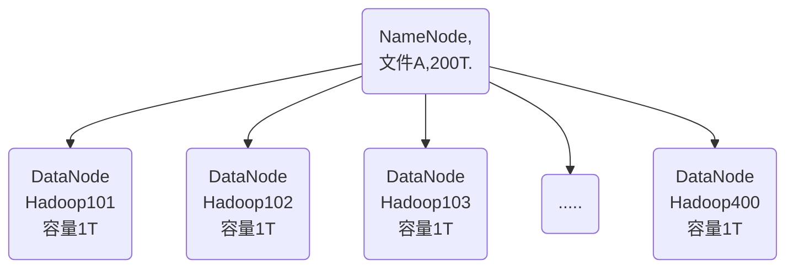

# Hadoop

---

### 基本概念

* HDFS 

  *NameNode*:类似索引，记录数据分布存储的位置，记录文件的属性。

  *DataNode*:具体数据存储的位置。

  *Secondary NameNode(2nn)*:每隔一段时间对NameNode进行备份，以防NameNode挂掉。图中未画出。

* YARN(Yet Another Resource Negotiator)，hadoop的资源管理器

  

  *可以有多个客户端，集群上能运行多个ApplicationMaster，每个NodeManager可以有多个容器*

  

* MapReduce

  *两个阶段*：

  1. Map阶段并行处理输入数据

  2. Reduce阶段对Map阶段进行汇总

     

* HDFS、YARN、MapReduce关系

  
  
  
  
  
  
  ### 大数据技术生态
  
  
  
  *常见的业务流程*
  
  

