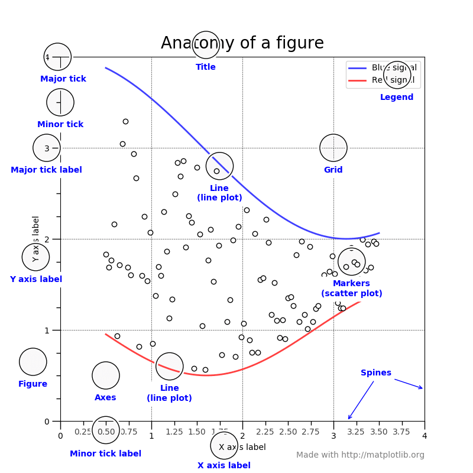
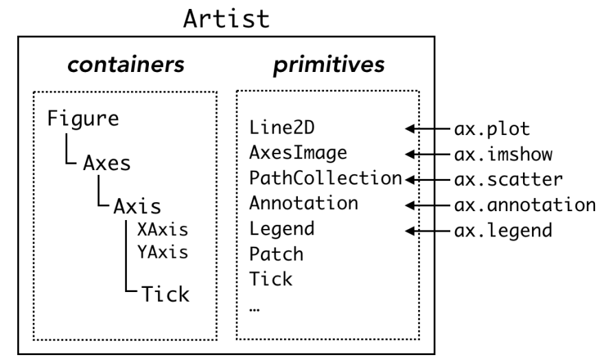

# matplotlib 的一些笔记

## 1、Anatomy of a figure

> [Matplotlib 中的 Artist——你在浪费时间瞎百度之前应该知道的东西 - 炸鸡人博客](https://zhajiman.github.io/post/matplotlib_artist/)
> 
> 
> 
> 从代表数据的线条和点到 X 轴的小刻度和文本标签，图中每个组件都是一个 `Artist` 对象[4](https://zhajiman.github.io/post/matplotlib_artist/#fn:4)。`Artist` 分为容器（container）和图元（primitive）两种类型。matplotlib 层级结构的三个组件——`Figure`、`Axes` 和 `Axis` 都是容器，可以容纳更低一级的容器和复数个图元，例如由 `ax.plot` 创建的 `Line2D`、`ax.scatter` 创建的 `PathCollection`，或 `ax.annotate` 创建的 `Text`。事实上，连刻度线和刻度标签都是 `Line2D` 和 `Text`，并且隶属于第四种容器 `Tick`。
> 
> 
> 
> 接下来概述一下这四种容器，表格摘自 [Artist tutorial](https://matplotlib.org/stable/tutorials/intermediate/artists.html)。
> 
> # 

