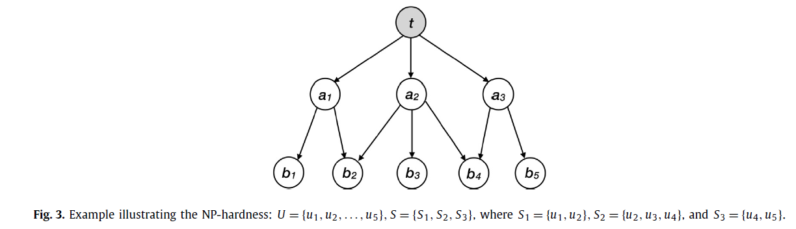
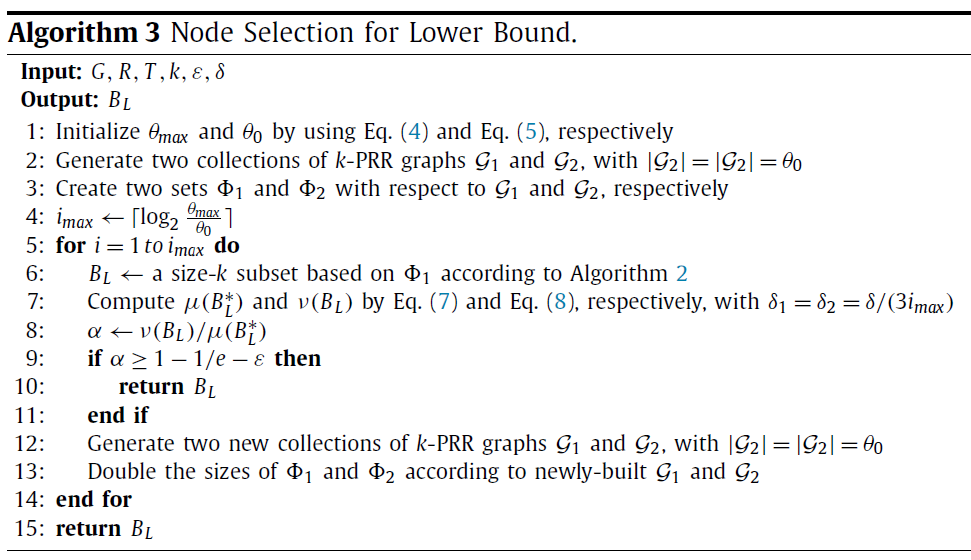
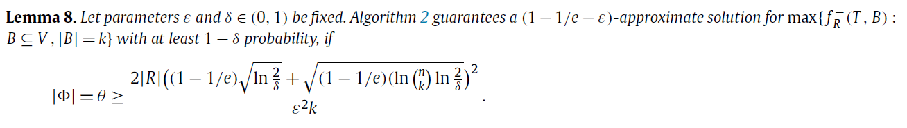
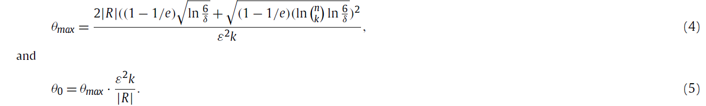
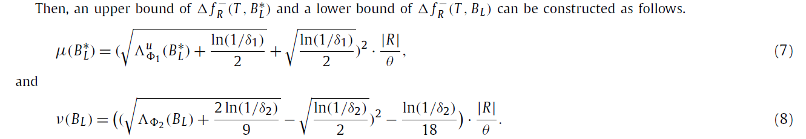
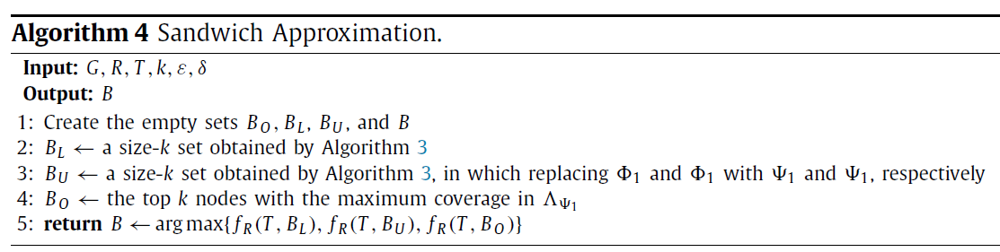
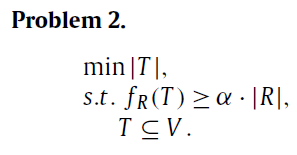
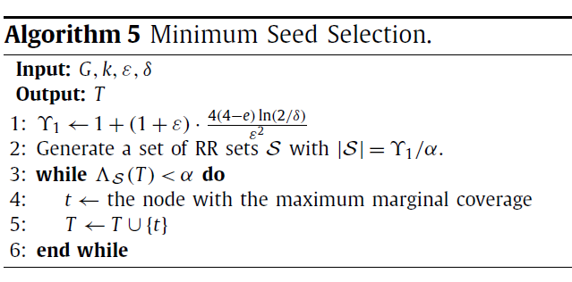

### Rumor correction maximization problem in social networks

**社会网络中的谣言纠正最大化问题**

Zhang Y, Yang W, Du D Z. Rumor correction maximization problem in social networks[J]. Theoretical Computer Science, 2021, 861: 102-116.

#### 1、名词、概念

Admittedly：[adv]诚然；无可否认

malicious：[adj]恶毒的

Containment：[n]遏制

leaflets：[n]传单

stifler：[n]扼杀者

monotone：[n]单调；[adj]单调的

##### 集合函数（set function）

> 有限集合$V=\{1,2,..,n\}$，集合函数 $f:2^V \rightarrow \R$。
>
> $2^V$是集合 V 的幂集，是 V 的所有子集组成的集合。
>
> 由于V的每个元素在它的子集里都有**选或者不选**两种可能，因此有$2^{|V|}$个元素。
>
> 即该函数的意思是，可以把 V 的子集映射到实数。

##### 次模函数 submodular function

> "边际效用递减" 的形式化说法。
>
> 对于给定一个集合函数$f:2^V \rightarrow \R$，若$S\subseteq V$，那么在S中增加一个元素所增加的收益要小于等于在 S 的子集中增加一个元素所增加的收益。
>
> 即对于函数 f，若$A\subseteq B \subseteq V \ and \ e\in V-B$，则$f(A\cup\{e\})-f(A) \ge f(B \cup \{e\})-f(B)$。

##### 无偏估计 unbiased estimation

> 无偏估计是用样本统计量来估计总体参数时的一种无偏推断。
>
> 例如：总体平均数未知，但知道部分样本，可计算出样本平均值。样本平均值不一定等于总体平均值，但这种估算方法没有系统上的偏差。即样本平均数是总体平均数的无偏估计。

#### 2、关于本文

> 谣言遏制问题**（Rumor Containment problem）**实际上与**影响最大化问题(Influence Maximization)**息息相关。
>
> 但谣言遏制问题是限制谣言的影响。下图中灰色的顶点是已感染的节点，白色顶点是未感染的顶点。如果只选一个顶点去阻止，那么选 u 这个顶点是最好的选择，可以纠正更多的被感染的点。对于 v 点，选它可以激活更多点，对于影响最大化问题来说是最佳选择。==突发奇想：能不能像森林防火一样挖一条 “防火带”，阻止谣言的传播？==
>
> 
>
> 
>
> 本文选取两种顶点集，来研究Rumor Correction Maximization problem，这两个集合分别为：seed nodes、boost nodes。
>
> boost nodes：当boost nodes提前收到相关信息时，它们更有可能成为采用者(adopter)。然而，如果没有邻居的影响，它可能不会成为采用者。
>
> **举个例子**：一家公司与其他公司竞争一个市场。它不仅可以为一些有影响力的用户提供免费的样品，也可以为一些个人提供传单。此外，传单的成本要比免费样品低得多。这家公司希望通过这两种策略获得最大的利润。
>
> 在这种情况下，把拥有免费样品的用户视为seed nodes，把拥有传单的用户视为boost nodes。
>
> 
> 
>
>
> 假设社会网络中存在两种信息，即谣言和真相，在社会网络中传播。我们假设谣言的传播过程已经停止，并且知道感染性节点。在给定预算的情况下，RCM问题要求种子节点和助推节点都能最大化预期的修正节点数量。

#### 3、传播模型

> **Boosting Independent Cascade (BIC) model**
>
> 给定一个网络G=(V, E)，对于每条边$e_{uv}$有两种影响概率：$p_{uv}$ 和  $p_{uv}^\prime(p^\prime_{uv}\ge p_{uv})$。
>
> 顶点有3种状态：infectious（如谣言接收者）、active（如真相接收者）、inactive。
>
> 假设传播谣言的过程已经结束，令感染性节点的集合为R。给定一组真相节点 T，一组加速节点（boost nodes）B，则具体过程如下：
>
> * t=0时刻，激活真相节点集 T。
> * $t \ge 1$时，每个新激活的顶点 u 只有一次机会去影响它的邻居（out-neighbor） v。如果 v 是boost node，它的邻居（in-neighbor）u 激活 v 的概率为 $p_{uv}^\prime$。否则，u 影响 v 的概率为$p_{uv}$。在 t 时刻以后，u 就不能再去影响其他顶点。
> * 循环上述过程，直至没有新的节点被激活。

#### 4、问题定义

> 给定感染顶点集R，真相集合T，加速节点集B，令$f_R(T,B)$为纠正顶点集R中的顶点数。因此有这样的问题：如何选择T和B，使$f_R(T,B)$在有限的预算下达到最大。称该问题为 Rumor Correction Maximization（RCM）problem。
>
> 当T已知，目标函数的计算是#P-hard；
>
> 给定R和T，找到大小为 k 的B，使得$f_R(T,B)$最大化，是NP-hard的问题，即Boosting Rumor Correction Maximization（BRCM）problem是NP-hard。
>
> 且不同的B、T组合会有不同的结果，有指数级的情况。
>
> **证明BRCM是NP-hard:**
>
> 
>
> 从集合覆盖进行规约。设$U=\set{u_1,u_2,..,u_n}$为所有节点（全集），$S=\set{S_1,S_2,..S_m}$为子集合的集合。
>
> 让节点 t 是真相集 T 的单子种子节点，谣言集$R=\{a_1,..,a_m,b_1,..,b_n\}$。
>
> 点$a_i$对应集合$S_i$，点$b_j$对应点$u_j$。
>
> 若$u_j\in S_i$，那么就有一条有限边从 $a_i$ 指向 $b_j$；
>
> 我们观察到，集合覆盖问题等同于看这个图中是否有一个包含k个节点的boost set B，使得 $f_R(T,B)\ge n+k$。
>
> *顶点* $a_i$ *就相当于 boost node set，也是谣言节点，因此有 f 大于等于n+k*

#### 5、近似算法

生成一个随机k-PRR(k-Potentially Reverse Reachable graph)图

> * 给定一个图G=(V,E)，一个点$r\in R$，整数k。
>
> * 先构建一个确定的图$G^\prime$且对应每条边上的影响传播$e_{uv}\in E$。
>
> * **live:**在$G^\prime$中，边$e_{uv}$是 live，对应的概率为$p_{uv}$。
>
> * **live-upon-boost：**在$G^\prime$中，边$e_{uv}$是 live-upon-boost，对应的边的概率为$p^\prime_{uv}-p_{uv}$。
>
> * **blocked：**在$G^\prime$中，边$e_{uv}$是 blocked，对应的边的概率为$1-p^\prime_{uv}$。
>
> * **k-PRR graph:**是$G^\prime$的子图，包含介于 T 和 r 之间的顶点的所有路径，且都是 non-blocked 的边，每条路径至多 k 个 live-upon-boost 边。
>
> * 如果 r 是从 R 中随机选取的，就称其为 random k-PRR graph。
>
> * 称一条路径是 *live*：当这条路径上的边都是 live 的。
>
> * 称一条路径是 *live-upon-boost*：该路径不是 live，但这条路径上的边是 live 或者是 live-upon-boost。
>   下图是一个 7个点6条边的图。r 是感染点，真相节点$T=\{t_1,t_2,t_3\}$。其中 live、live-upon-boost 和 block 边分别用实线、虚线、带x的点线表示。方框中表示一个 2-PRR图，路径 $t_1$到 r 是 *live-upon-boost*。
>
>   
>
> * $d[v]$：所有点 v 至 点 r 的路径中，live-upon-boost 边的数量的最小值。
>
> * $N^+(v)$：顶点 v 的 in-neighbors。
>
> * $N^-(v)$：顶点 v 的out-neighbors。
>
> * 如果边$e_{uv}$是 live-upon-boost，$weight[e_{uv}]=1$，否则$weight[e_{uv}]=0$。
>
> * *就是使用了广度优先的方法，更新 d[u] 的值，并且其小于 k 时，将边放入 g 中。*
>
> 

假设真相集T是已知的，并且k-PRR图的数量θ足够大。使用贪心算法获得次模下界$f_R^-(T,B)$的近似解。在每个迭代中，它选择具有最大边际覆盖率的节点。之后的算法3会调用该算法。

> * $\Phi_g=\set{v\in V:I^-_g(\set{v})-I^-_g(\empty)=1}$：即对于$v \in \Phi_g$，g 为 k-PRR图，存在一条 live upon boosting v的路径。
> * 用$\mathcal{G}$表示k-PRR 图的集合，$|\mathcal{G}|=\theta,\mathcal{G}=\set{g_1,g_2,..,g_\theta}$，相应的有$\Phi=\set{\Phi_{g_1},\Phi_{g_2},..,\Phi_{g_\theta}}$
>
> 

为了最小化运行时间，使用一个近似的解决方案。其基本思想见于算法3。它首先根据k-PRR图创建两个集合$\Phi_1$和$\Phi_2$。接下来，根据Algorithmm2得到一个集合$B_L$，它是$\Phi_1$的最大覆盖集合。接下来，使用集合$B_L$的下限和最优解$B^∗_L$的上限之间的分数来计算近似比率。下限和上限分别由$\Phi_2$和$\Phi_1$产生。如果比率小于$1 -1/e -\epsilon$，它就向$\Phi_1$和$\Phi_2$插入新的集合。否则，它返回结果。

>
>
>
>
>
>
>

整合影响反向采样（Influence Reverse Sampling，RIS）技术和三明治近似（sandwich approximation，SA）策略得到算法4。使用算法3，我们首先得到一个k-size 的结点集$B_L$。此外，我们只用$\Psi_1$和$\Psi_2$来代替算法3中的$\Phi_1$和$\Phi_2$。然后，我们可以有其他节点集$B_U$。我们选择在$\Psi_1$中具有最大覆盖率的 top k 节点作为原始问题的解决方案$B_O$。最后，在$B_O$、$B_L$和$B_U$三个集合中，我们返回具有最大估计的谣言修正的集合作为最终解决方案。

> 

在大多数情况下，我们不知道seed nodes和boost nodes的确切数量。因此，我们希望研究在seed 和 boost 上分配预算的策略。给定一个参数$\alpha \in [0, 1]$，我们在下文中提出最小种子选择（MSS）问题。该参数代表了真相集 T 所纠正的感染性节点的最小部分。MSS问题试图给出真相集 T 的最小尺寸，使 T 能够纠正至少 $\alpha-|R|$ 个感染节点。

> RR：Reverse Reachable。
>
> S：RR集的集合。
>
> $\Lambda_S(T)$：T 所覆盖的 S 中的 RR集的比例。是对$f_R(T)$的无偏估计(unbiased estimation)。
>
> 
>
> 

