### Rumor correction maximization problem in social networks

**社会网络中的谣言纠正最大化问题**

Zhang Y, Yang W, Du D Z. Rumor correction maximization problem in social networks[J]. Theoretical Computer Science, 2021, 861: 102-116.

#### 1、名词、概念

Admittedly：[adv]诚然；无可否认

malicious：[adj]恶毒的

Containment：[n]遏制

leaflets：[n]传单

stifler：[n]扼杀者

monotone：[n]单调；[adj]单调的

##### 集合函数（set function）

> 有限集合$V=\{1,2,..,n\}$，集合函数 $f:2^V \rightarrow \R$。
> 
> $2^V$是集合 V 的幂集，是 V 的所有子集组成的集合。
> 
> 由于V的每个元素在它的子集里都有**选或者不选**两种可能，因此有$2^{|V|}$个元素。
> 
> 即该函数的意思是，可以把 V 的子集映射到实数。

##### 次模函数 submodular function

> "边际效用递减" 的形式化说法。
> 
> 对于给定一个集合函数$f:2^V \rightarrow R$，若$S\subseteq V$，那么在S中增加一个元素所增加的收益要小于等于在 S 的子集中增加一个元素所增加的收益。
> 
> 即对于函数 f，若$A\subseteq B \subseteq V \ and \ e\in V-B$，则$f(A\cup\{e\})-f(A) \ge f(B \cup \{e\})-f(B)$。

##### 无偏估计 unbiased estimation

> 无偏估计是用样本统计量来估计总体参数时的一种无偏推断。
> 
> 例如：总体平均数未知，但知道部分样本，可计算出样本平均值。样本平均值不一定等于总体平均值，但这种估算方法没有系统上的偏差。即样本平均数是总体平均数的无偏估计。

#### 2、关于本文

> 谣言遏制问题**（Rumor Containment problem）**实际上与**影响最大化问题(Influence Maximization)**息息相关。
> 
> 但谣言遏制问题是限制谣言的影响。下图中灰色的顶点是已感染的节点，白色顶点是未感染的顶点。如果只选一个顶点去阻止，那么选 u 这个顶点是最好的选择，可以纠正更多的被感染的点。对于 v 点，选它可以激活更多点，对于影响最大化问题来说是最佳选择。==突发奇想：能不能像森林防火一样挖一条 “防火带”，阻止谣言的传播？==
> 
> 
> 
> 本文选取两种顶点集，来研究Rumor Correction Maximization problem，这两个集合分别为：seed nodes、boost nodes。
> 
> boost nodes：当boost nodes提前收到相关信息时，它们更有可能成为采用者(adopter)。然而，如果没有邻居的影响，它可能不会成为采用者。
> 
> **举个例子**：一家公司与其他公司竞争一个市场。它不仅可以为一些有影响力的用户提供免费的样品，也可以为一些个人提供传单。此外，传单的成本要比免费样品低得多。这家公司希望通过这两种策略获得最大的利润。
> 
> 在这种情况下，把拥有免费样品的用户视为seed nodes，把拥有传单的用户视为boost nodes。
> 
> 假设社会网络中存在两种信息，即谣言和真相，在社会网络中传播。我们假设谣言的传播过程已经停止，并且知道感染性节点。在给定预算的情况下，RCM问题要求种子节点和助推节点都能最大化预期的修正节点数量。

#### 3、传播模型

> **Boosting Independent Cascade (BIC) model**
> 
> 给定一个网络G=(V, E)，对于每条边$e_{uv}$有两种影响概率：$p_{uv}$ 和  $p_{uv}^\prime(p^\prime_{uv}\ge p_{uv})$。
> 
> 顶点有3种状态：infectious（如谣言接收者）、active（如真相接收者）、inactive。
> 
> 假设传播谣言的过程已经结束，令感染性节点的集合为R。给定一组真相节点 T，一组加速节点（boost nodes）B，则具体过程如下：
> 
> * t=0时刻，激活真相节点集 T。
> * $t \ge 1$时，每个新激活的顶点 u 只有一次机会去影响它的邻居（out-neighbor） v。如果 v 是boost node，它的邻居（in-neighbor）u 激活 v 的概率为 $p_{uv}^\prime$。否则，u 影响 v 的概率为$p_{uv}$。在 t 时刻以后，u 就不能再去影响其他顶点。
> * 循环上述过程，直至没有新的节点被激活。

#### 4、问题定义

> 给定感染顶点集R，真相集合T，加速节点集B，令$f_R(T,B)$为纠正顶点集R中的顶点数。因此有这样的问题：如何选择T和B，使$f_R(T,B)$在有限的预算下达到最大。称该问题为 Rumor Correction Maximization（RCM）problem。
> 
> 当T已知，目标函数的计算是#P-hard；
> 
> 给定R和T，找到大小为 k 的B，使得$f_R(T,B)$最大化，是NP-hard的问题，即Boosting Rumor Correction Maximization（BRCM）problem是NP-hard。
> 
> 且不同的B、T组合会有不同的结果，有指数级的情况。
> 
> **证明BRCM是NP-hard:**
> 
> 
> 
> 从集合覆盖进行规约。设$U=\{u_1,u_2,..,u_n\}$为所有节点（全集），$S=\{S_1,S_2,..S_m\}$为子集合的集合。
> 
> 让节点 t 是真相集 T 的单子种子节点，谣言集$R=\{a_1,..,a_m,b_1,..,b_n\}$。
> 
> 点$a_i$对应集合$S_i$，点$b_j$对应点$u_j$。
> 
> 若$u_j\in S_i$，那么就有一条有限边从 $a_i$ 指向 $b_j$；
> 
> 我们观察到，集合覆盖问题等同于看这个图中是否有一个包含k个节点的boost set B，使得 $f_R(T,B)\ge n+k$。
> 
> *顶点* $a_i$ *就相当于 boost node set，也是谣言节点，因此有 f 大于等于 n+k*。

#### 5、近似算法

生成一个随机k-PRR(k-Potentially Reverse Reachable graph)图

> * 给定一个图G=(V,E)，一个点$r\in R$，整数k。
> 
> * 先构建一个确定的图$G^\prime$且对应每条边上的影响传播$e_{uv}\in E$。
> 
> * **live**:在$G^\prime$中，边$e_{uv}$是 live，对应的概率为$p_{uv}$。
> 
> * **live-upon-boost**：在$G^\prime$中，边$e_{uv}$是 live-upon-boost，对应的边的概率为$p^\prime_{uv}-p_{uv}$。
> 
> * **blocked**：在$G^\prime$中，边$e_{uv}$是 blocked，对应的边的概率为$1-p^\prime_{uv}$。
> 
> * **k-PRR graph:** 是$G^\prime$的子图，包含介于 T 和 r 之间的顶点的所有路径，且都是 non-blocked 的边，每条路径至多 k 个 live-upon-boost 边。
> 
> * 如果 r 是从 R 中随机选取的，就称其为 random k-PRR graph。
> 
> * 称一条路径是 *live*：当这条路径上的边都是 live 的。
> 
> * 称一条路径是 *live-upon-boost*：该路径不是 live，但这条路径上的边是 live 或者是 live-upon-boost。
>   下图是一个 7个点6条边的图。r 是感染点，真相节点$T=\{t_1,t_2,t_3\}$。其中 live、live-upon-boost 和 block 边分别用实线、虚线、带x的点线表示。方框中表示一个 2-PRR图，路径 $t_1$到 r 是 *live-upon-boost*。
>   
>   
> 
> * $d[v]$：所有点 v 至 点 r 的路径中，live-upon-boost 边的数量的最小值。
> 
> * $N^+(v)$：顶点 v 的 in-neighbors。
> 
> * $N^-(v)$：顶点 v 的out-neighbors。
> 
> * 如果边$e_{uv}$是 live-upon-boost，$weight[e_{uv}]=1$，否则$weight[e_{uv}]=0$。
> 
> * *就是使用了广度优先的方法，更新 d[u] 的值，并且其小于 k 时，将边放入 g 中。*
> 
> 

假设真相集T是已知的，并且k-PRR图的数量θ足够大。使用贪心算法获得次模下界$f_R^-(T,B)$的近似解。在每个迭代中，它选择具有最大边际覆盖率的节点。之后的算法3会调用该算法。

> * $\Phi_g=\{v\in V:I^-_g(\{v\})-I^-_g(\emptyset)=1\}$：即对于$v \in \Phi_g$，g 为 k-PRR图，存在一条 live upon boosting v的路径。
> * 用$\mathcal{G}$表示k-PRR 图的集合，$|\mathcal{G}|=\theta,\mathcal{G}=\{g_1,g_2,..,g_\theta\}$，相应的有$\Phi=\{\Phi_{g_1},\Phi_{g_2},..,\Phi_{g_\theta}\}$
> 
> 

为了最小化运行时间，使用一个近似的解决方案。其基本思想见于算法3。它首先根据k-PRR图创建两个集合$\Phi_1$和$\Phi_2$。接下来，根据Algorithmm2得到一个集合$B_L$，它是$\Phi_1$的最大覆盖集合。接下来，使用集合$B_L$的下限和最优解$B^∗_L$的上限之间的分数来计算近似比率。下限和上限分别由$\Phi_2$和$\Phi_1$产生。如果比率小于$1 -1/e -\epsilon$，它就向$\Phi_1$和$\Phi_2$插入新的集合。否则，它返回结果。

> 
> 
> 
> 
> 
> 
> 

整合影响反向采样（Influence Reverse Sampling，RIS）技术和三明治近似（sandwich approximation，SA）策略得到算法4。使用算法3，我们首先得到一个k-size 的结点集$B_L$。此外，我们只用$\Psi_1$和$\Psi_2$来代替算法3中的$\Phi_1$和$\Phi_2$。然后，我们可以有其他节点集$B_U$。我们选择在$\Psi_1$中具有最大覆盖率的 top k 节点作为原始问题的解决方案$B_O$。最后，在$B_O$、$B_L$和$B_U$三个集合中，我们返回具有最大估计的谣言修正的集合作为最终解决方案。

> 

在大多数情况下，我们不知道seed nodes和boost nodes的确切数量。因此，我们希望研究在seed 和 boost 上分配预算的策略。给定一个参数$\alpha \in [0, 1]$，我们在下文中提出最小种子选择（MSS）问题。该参数代表了真相集 T 所纠正的感染性节点的最小部分。MSS问题试图给出真相集 T 的最小尺寸，使 T 能够纠正至少 $\alpha-|R|$ 个感染节点。

> RR：Reverse Reachable。
> 
> S：RR集的集合。
> 
> $\Lambda_S(T)$：T 所覆盖的 S 中的 RR集的比例。是对$f_R(T)$的无偏估计(unbiased estimation)。
> 
> 
> 
> 

### Containment of rumor spread in complex social networks

**遏制复杂社会网络中的谣言传播**

#### 1、名词概念

prevalence：[n]流行，流行程度

heterogeneity:[n]异质性

counterexample：[n]反例

##### 纳什均衡 Nash equilibrium

> 又称非合作博弈均衡。在一个博弈过程中，无论对方的策略选择如何，当事人一方都会选择某个确定的策略，则该策略被称作支配性策略。如果两个博弈的当事人的策略组合分别构成各自的支配性策略，那么这个组合就被定义为纳什均衡。　　
> 
> 一个策略组合被称为纳什均衡，当每个博弈者的均衡策略都是为了达到自己期望收益的最大值，与此同时，其他所有博弈者也遵循这样的策略。
> 
> 典型情况：囚徒困境

#### 2、关于本文

> 两种策略：
> 
> 1. 网络中断（删除某些重要的点、边）：<mark>实际应用中不太可行</mark>。干扰网络结构对控制者来说不太可能。删除关键节点是一种审查形式，可能违反道德标准。
> 
> 2. 平衡策略（释放正确信息来抵消负面影响）：该策略是本文所采取的。
> 
> 传播模型：
> 
> 传统的传播模型不太适用于存在竞争性信息传播的情况。通常假设竞争者的播种策略已经固定，并且是已知的。在所有竞争者都可能调整其战略的情况下，人们从博弈论的角度提出了纳什均衡分析。
> 
> **“我们不研究竞争性影响最大化问题，而是通过选择一组合适的节点，在检测到谣言后传播真相，来解决谣言传播最小化的问题。”**(讲这么久才说)
> 
> 对于其他人提出的谣言、真相同时传播的模型，有的是优先接收谣言，有的是优先接收真相，接收的概率不是0就是1，**不太符合实际情况**。
> 
> 此外，所有提到的竞争性扩散模型都假定，一旦一个人被一种类型的信息激活，他/她就会永远保持这种状态，永远不会改变他/她的想法。这个假设对与购买行为相关的产品采用很有效，因为购买行为通常不容易逆转，但对信息传播或意见形成却不适用，因为人们对某一政治活动或新闻事件的态度会根据从网络上收集到的新信息而改变。
> 
> <mark>本文基于线性阈值模型进行改进：</mark>
> 
> Linear Threshold model with One Direction state Transition (LT1DT for short)
> 
> 1. 两种阈值：influence threshold和decision threshold，分别用于激活inactive node和转化rumor activated node。
> 
> 2. 允许对已经接受谣言的节点进行重新考虑（成为真相节点），但不允许对已经接受真相的节点进行重新考虑。
> 
> <mark>采用平衡策略的最小化谣言传播问题是NP-hard</mark>
> 
> 提出了一个启发式算法*ContrId*，并于pagerank 和 贪心法进行比较。
> 
> <mark>研究接近效应</mark>
> 
> 在谣言节点周围放置真相节点的效果。

#### 3、传播模型

> Linear Threshold model with One Direction state Transition (LT1DT for short)
> 
> * **LT1DT网络N是一个4元组（4-tuple），$(G(V,E),W,\theta,\theta^R)$。**
> 
> > $G(V,E)$是一个有向图；
> > 
> > 函数$\theta,\theta^R$是$V\rightarrow(0,1]$的映射，为$u\in V$中的点分配阈值，influence threshold $\theta_u\in(0,1]$(被影响的概率)，decision threshold $\theta_u^R\in(0,1]$(被影响后发生改变的概率)；
> > 
> > 函数$W$是$V\times V\rightarrow (0,1]$的映射，为图中的边分配权重，$W(u,v)\in(0,1]$,
> 
> 
> 
> $$
> \left\{
\begin{aligned}
&W(u,v)=0,(u,v)\notin V \\
&\sum_{u\in V}W(u,v)=1,\text{for all }v\in V
\end{aligned}
\right.
> $$
> 
> 
> 
> 
> * **扩散动力（diffusion dynamic）**
> 
> > 每个节点有3种状态：inactive、R-active（adopting R）、T-active（adopting T），一个转移状态：influenced。*（R、T代表两种观点、事物，如谣言和真相）*
> > 
> > $S_R$：表示t=0时接收R的顶点集。
> > 
> > $\phi_t^T$：表示t时刻接收T的顶点集。
> > 
> > $\Phi_t^T=\bigcup_{k=0}^t\phi^T_k$：表示$[0,t]$这段时间内接收T的顶点集。
> > 
> > $\phi_t^{R\rightarrow T}$：表示t时刻从R-active转变为T-active的顶点集。
> > 
> > $\Phi_t^R=\bigcup_{k=0}^t\phi_k^R /\bigcup_{k=0}^t\phi_t^{R\rightarrow T}$:表示t时刻，在$[0,t]$这段时间内接收R且没发生转变的顶点集。
> > 
> > $\Phi_t=\Phi_t^T\cup \Phi_t^R$：在t时刻为激活状态的顶点集，$\Phi_0=S_R\cup S_T$。
> 
> 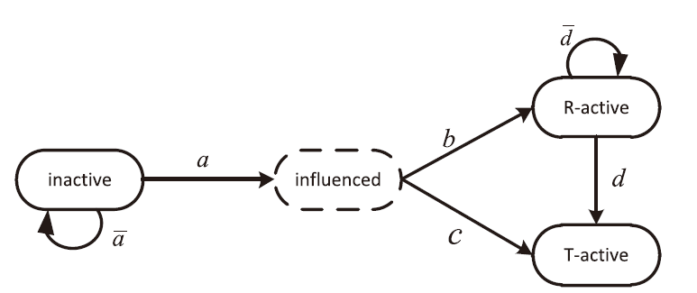
> 
> * **激活流程（activation process）**
> 
> > influence stage：未激活的点u的已激活的入邻居（active in-neighbors）权重之和，大于等于$\theta_u$，那么点u就变为 influenced。*(决定是否进入激活状态)*
> 
> $$
> \text{u is influenced}\Leftrightarrow \sum_{v\in N_u^{in}\cap\Phi_{t-1}}W(v,u)\ge \theta_u
> $$
> 
> $$
> u\in \phi_t^R \Leftrightarrow 
\frac{\sum_{v\in N^{in}_u \cap \Phi_{t-1}^R}W(v,u)}
{\sum_{v\in N^{in}_u \cap \Phi_{t-1}}W(v,u)} \ge \theta_u^R
> $$

> > decision stage：顶点 u 的 R-active in-neighbors 的权重之和比上顶点u的 active in-neighbors 的权重之和，大于等于\theta_u^R，那么顶点u就会接收 R。**否则接收T**，u\in \phi_t^T。
> > 
> > **~~发现一个问题：假设 node A 达到了 influence threshold，其邻居都是 R-active，没有 T-active。但没有达到 decision threshold，即 node A 会接收 T。但这合理吗？其周围没有 T-active邻居，却能变成 T-active？~~** (感觉又没问题了。。。)
> 
> * **系统动态分析(Analysis of the system’s dynamics)**
> 
> > $\Phi_R^*(S_R,S_T)$：最终（稳定状态）接收 R 的顶点集合 *(相当于一个集合函数 )*。
> > 
> > $\Phi_T^*(S_R,S_T)$：最终（稳定状态）接收 T 的顶点集合 *(相当于一个集合函数 )*。
> > 
> > $\Phi^*(S_R,S_T)$：最终处于激活状态的顶点集合 *(相当于一个集合函数)*。
> > 
> > **上述的表达式是关于初始种子节点的选取对最终激活节点的影响。**
> > 
> > 给定了$S_R$，那么$|\Phi^*(S_R,S_T)|$和$|\Phi_T^*(S_R,S_T)|$就是关于$S_T$递增的,单调的；但对于$|\Phi_R^*(S_R,S_T)|$而言，就不一定是递减的，是非单调的，因为增加 T 的种子节点并不一定能减少 R 的扩散。
> > 
> > 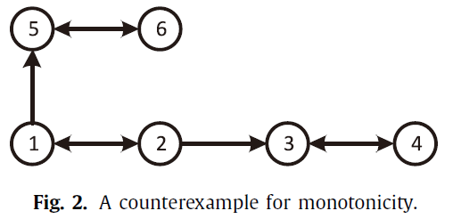
> > 
> > 上图展示了一个反例。
> > 
> > 设$S_R=\{1\},W(u,v)=\frac{1}{|N_v^{in}|}$,$\theta_2,\theta_3 \in (0.5,1],\theta_5 \in (0,0.5),\theta_2^R,\theta_3^R\in(0,0.5),\theta_5^R\in(0.5,1]$
> > 
> > 不设置T时：$\Phi_R^*(S_R,\emptyset)=\{1,2,5,6\}$；
> > 
> > 设置 $S_T=\{6\}$时：$\Phi_R^*=\{1,2\},\Phi_T^*=\{5,6\}$，减小了 R 的扩散；
> > 
> > 设置 $S_T=\{4\}$时：$\Phi_R^*=\{1,2,5,6,3\}，\Phi_T^*=\{4\}$,节点3从节点4获得额外的影响，但因为decision threshold，采用了 R，扩大了R的影响。

#### 4、问题定义

> * 谣言最小化传播(Minimizing rumor spread,MRS)
> 
> > 谣言遏制的问题是选择一组合适的节点来传播真相，以尽量减少最终接受谣言的节点数量。
> > 
> > *给定 LT1DT 模型，谣言种子节点 $S_R$。给定整数 ，在 $V/S_R$中找到真相种子节点 $S_T=X$,满足$|S_T|\le k$，使得最终 R 接收者数量最小。*
> 
> $$
> \begin{array} {}
\min |\Phi_R^*(S_R,X)| \\
\text{s.t. } X \subseteq V/S_R \\
|X|\leq k
\end{array}
> $$

> * 从最大覆盖问题(Maximum Coverage Problem,MCP)归约到本问题。
> 
> > $MCP\le MRS$
> > 
> > 按照MCP的定义构建了一个MRS的实例。
> > 
> > **MCP**:集合 $O=\{o_1,o_2,\dots,o_q\}$ 含有 q 个元素, 集合的集合$\mathcal{X}=\{X_1,X_2,...,X_p\}$,其中$X_i$是元素为$o_j\in O$的集合。给定一个正的常数 $l$，找到一个 $\mathcal{X}^\prime \subset \mathcal{X}$, 满足$|\mathcal{X}^\prime|\le l$, 使得$|\bigcup_{X_i\in \mathcal{X}^\prime}X_i|$覆盖 $O$ 中的元素数量最大。
> 
> $$
> \begin{array}{}
\max |\bigcup_{X_i\in \mathcal{X}^\prime}X_i| \\
\text{s.t. } \mathcal{X}^\prime \subset \mathcal{X} \\
|\mathcal{X}^\prime|\le l
\end{array}
> $$
> 
> 归约证明：
> 
> 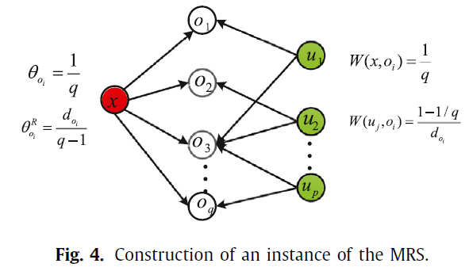
> 
> 给定MCP的一个实例$\mathcal{I}=(O,\mathcal{X},l,\lambda)$,相应地构建一个MRS实例$\mathcal{M}=(V,E,\theta,\theta^R,W,S_R,k,\rho)$。
> 
> 编号从0开始（图示是从 1 开始，可能原文有误），为每个子集 $X_i\in \mathcal{X}$ 添加一个节点 $u_i$, 为$O$中的每个元素添加一个节点$o_j$,以及一个特殊节点 x 。
> 
> 然后将 x 连接到每个节点$o_j$，并为每个$o_j∈X_i$添加一条边$(u_i,o_j)$。
> 
> 以节点$o_3$为例，它至少有3条入射边(来自$u_1,u_2,u_p$)，这意味着$o_i$至少存在于相应的子集$X_1 , X_2 , X_p$中。
> 
> 每个节点 $o_i$ 给定了相同的influence threshold $\theta_{o_i}=1/q$ 和 decision threshold $\theta_{o_i}^R = \frac{d_{o_i}}{q-1}$, 正整数$d_{o_i}$为元素$o_i$所属的子集$X_i$的数量。
> 
> 从节点x到节点$o_i$的弧的权重被设定为1/q，即$W(x,o_i)=1/q$。从$u_j$到$o_i$的弧的权重是同质的，设置为$（1 -1 /q ）/d_{o_i}$，即$W(u_j,o_i)=(1-1/q)/d_{o_i}$。然后，对于每个$o_i$，从x和$u_j$传入的权重之和为1。
> 
> 最后设置$S_R=\{x\},k=l,\rho=q-\lambda+1$。
> 
> <mark>证明：</mark>
> 
> 假设$\mathcal{X}^*$是实例$\mathcal{I}$的一个解，$|\mathcal{X}^*|\le l$，能够覆盖$O$中至少$\lambda$个元素。我们可以选择对应于子集$X_j∈\mathcal{X}^∗$的所有节点$u_j$作为真相种子集$S_T$,因此$|S_T|=k=l$。
> 
> 因为$\mathcal{X}^*$可以覆盖$O$中至少$\lambda$个$o_i$元素,即$O$中至少有$\lambda$个节点相信真相。这是因为对于任何被覆盖的$o_i$，让$d^∗_{o_i}$为$o_i$所属的子集$X_j∈\mathcal{X}^∗$的数量，那么我们有$1 ≤d^∗_{o_i} ≤d_{o_i}$。
> 
> 那么，来自谣言和真相的总影响为$1/q+d^*_{o_i}(\frac{1-1/q}{d_{o_i}})\ge \theta_{o_i}=1/q$。来自其R-active邻居的权重之和为1/q。因此$o_i$会相信真相，因为
> 
> $$
> \frac{1/q}{1/q+d^*_{o_i}(\frac{1-1/q}{d_{o_i}})}
\le \frac{1/q}{1/q+\frac{1-1/q}{d_{o_i}}}
= \frac{d_{o_i}}{d_{o_i}+q-1}
< \theta^R_{o_i}= \frac{d_{o_i}}{q-1}
> $$

> 因此，在MRS问题中，T-final adopter set的基数至少是λ+ k，R-final adopter set的cardinality最多是ρ= q -λ+ 1。
> 
> **反之**，假设$S_T^*$是实例$\mathcal{M}$的一个解，即，$|S^∗_T| = k$，这样R-final adopter 集的基数最多为$\rho$。这意味着T-final adopter集合的基数至少是$q-(\rho-1)+k$。那么$\mathcal{X}^∗$可以是一个子集$X_i$的集合，对应于那些$u_i∈S^∗_T$。因此，$\mathcal{X}^∗$的大小为k，因为根据假设，$l = k$，并且至少可以覆盖$O$中的$q -\rho+ 1$个元素。

#### 5、启发式算法

> 根据选择 truth seed 的搜索空间，它们可以分为两类，无约束(unconstrained)和有约束(constrained)。
> 
> **unconstrained:** 可在$V/S_R$中根据具体的判定，选择任意点作为 truth seed。
> 
> * MinGreedy
> 
> > 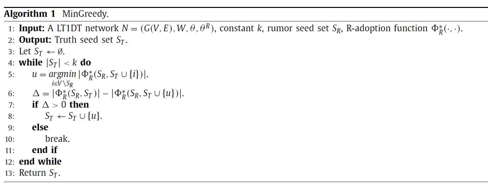
> 
> > 在每个迭代中，将最大限度地减少谣言传播的节点u添加到真相种子集$S_T$中（第5行）。
> > 
> > 在每个迭代中，对于每个候选节点$w∈V/S_R$，需要计算相应的final adopter集合，这可能需要检查每个节点是否被激活，这可以在$O ( nd )$ 的时间内完成。因此，MinGreedy的时间复杂性为$O ( kdn^2 )$。
> 
> * PageRank
> 
> $$
> \textbf{p}=(1-\gamma)\hat A \textbf{p} + \frac{\gamma}{n} \textbf{1}
> $$

> > [知乎文章](https://zhuanlan.zhihu.com/p/137561088#:~:text=PageRank%E7%AE%97%E6%B3%95%E7%9A%84%E5%9F%BA%E6%9C%AC%E6%83%B3%E6%B3%95%E6%98%AF%E5%9C%A8%E6%9C%89%E5%90%91%E5%9B%BE%E4%B8%8A%E5%AE%9A%E4%B9%89%E4%B8%80%E4%B8%AA%E9%9A%8F%E6%9C%BA%E6%B8%B8%E8%B5%B0%E6%A8%A1%E5%9E%8B%EF%BC%8C%E5%8D%B3%E4%B8%80%E9%98%B6%E9%A9%AC%E5%B0%94%E5%8F%AF%E5%A4%AB%E9%93%BE%EF%BC%8C%E6%8F%8F%E8%BF%B0%E9%9A%8F%E6%9C%BA%E6%B8%B8%E8%B5%B0%E8%80%85%E6%B2%BF%E7%9D%80%E6%9C%89%E5%90%91%E5%9B%BE%E9%9A%8F%E6%9C%BA%E8%AE%BF%E9%97%AE%E5%90%84%E4%B8%AA%E7%BB%93%E7%82%B9%E7%9A%84%E8%A1%8C%E4%B8%BA%E3%80%82,%E5%9C%A8%E4%B8%80%E5%AE%9A%E6%9D%A1%E4%BB%B6%E4%B8%8B%EF%BC%8C%E6%9E%81%E9%99%90%E6%83%85%E5%86%B5%E8%AE%BF%E9%97%AE%E6%AF%8F%E4%B8%AA%E7%BB%93%E7%82%B9%E7%9A%84%E6%A6%82%E7%8E%87%E6%94%B6%E6%95%9B%E5%88%B0%E5%B9%B3%E7%A8%B3%E5%88%86%E5%B8%83%EF%BC%8C%E8%BF%99%E6%97%B6%E5%90%84%E4%B8%AA%E7%BB%93%E7%82%B9%E7%9A%84%E5%B9%B3%E7%A8%B3%E6%A6%82%E7%8E%87%E5%80%BC%E5%B0%B1%E6%98%AF%E5%85%B6PageRank%E5%80%BC%EF%BC%8C%E8%A1%A8%E7%A4%BA%E7%BB%93%E7%82%B9%E7%9A%84%E9%87%8D%E8%A6%81%E5%BA%A6%E3%80%82)
> > 
> > 使用 teleportation model 计算PageRank value。（即对于没有出度的点，使其出度的概率为1，如下图中的 m 点）
> > 
> > 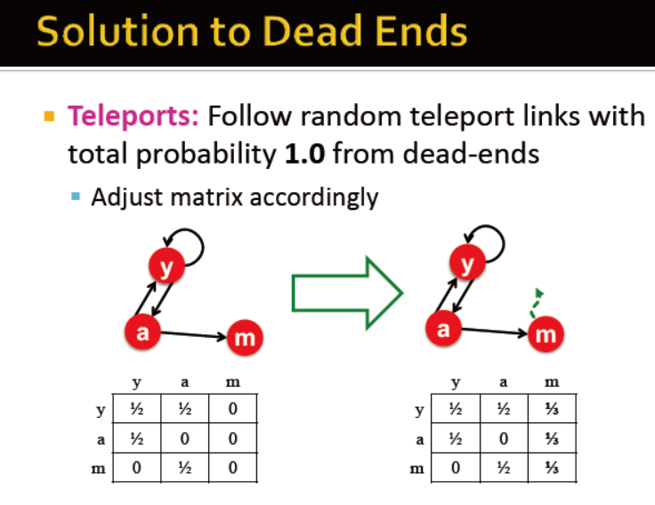
> > 
> > 带重启的随机游走,每一步选择相邻节点，或者开始节点,重启概率 $\gamma=0.15$。$\textbf{p}$ 为 PageRank向量，$\sum_{i=1}^n p_i=1$，$p_i$为节点 i 的pagerank value。$\textbf{1}$为所有分量为 1 的向量。*(文章没有给初始的 P，但我感觉每个点的初始值应该相同，即 1/N，N为顶点总数。)*
> > 
> > 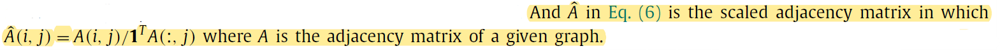
> > 
> > $\hat A(i,j)=A(i,j)/(\textbf{1}^T A(:,j))$ 。$\hat A$是邻接矩阵 A 的缩放,即对应元素除以该列之和，也就是<mark>百分比，就是个状态转移矩阵</mark>。原文（如上图）对$\hat A$的定义感觉不太严谨，因该加个括号。
> > 
> > PageRank在$V/S_R$中选择了 k 个具有最高pagerank值的节点作为真相种子。
> > 
> > 由于缩放的邻接矩阵$\hat A$是一个稀疏矩阵，每行平均有d个非零元素（所谓的网络平均度），矩阵和向量的乘法可以在 $O ( nd )$ 的时间内完成。
> > 
> > 因此，pagerank值的计算需要时间$O(n(d+1)I)$，其中I是p收敛到合理近似值的迭代次数。最终需要选 k 个真相点，因此时间复杂度为$O(n(d+1)I+nk)$。
> 
> * ContrId
> 
> > PageRank完全取决于网络结构。作者提出了一种新的启发式方法ContrId（Contributors Identification），它基于谣言传播的动态，试图识别哪些节点对谣言传播贡献最大（称为贡献者），并中断谣言从谣言种子传播到其余网络的重要路径。
> > 
> > 在 $t_v$ 时刻被激活的节点 v 的 contribution ，定义为其在任何 $t > t_v $ 被激活的外邻的数量。
> > 
> > 首先模拟谣言传播，谣言种子集$S_R$，真相种子集$S_T=\emptyset$，记录从$1\sim T_s$每一步激活的节点集，$T_s$为网络进入最终稳定状态的时刻。令$L$为最长 simple path 的长度，有$T_s \le L$，因为扩散过程至多 L steps。对于每个点 $v\in \phi_t^R$，有
> 
> $$
> Ctr(v)=|(\cup_{i=t+1}^{T_s}\phi_i^R)\cap N_v^{out}|
> $$
> 
> > 对于 inactive 节点，贡献设置为 0 。
> 
> **Constrainted**：约束版本（称为ProxMinGreedy、ProxPageRank和ProxContrId），将搜索空间限制在谣言种子集的附近。
> 
> $S_R-\text{proximity space}$：$\mathcal{N}^{out}(S_R)=(\cup_{v\in S_R}N_v^{out})$
> 
> 其思路是阻断从谣言种子到剩余网络的有影响力的路径。
> 
> * ProxMinGreedy
> 
> > 每次迭代中，在$\mathcal{N}^{out}(S_R)$中选最大限度地减少谣言传播的节点u添加到真相种子集$S_T$中，共选k个点。算法还是algorithm 1，只是第5行换成：
> 
> $$
> u=\mathop{argmin}\limits_{i\in \mathcal{N}^{out}(S_R)}
|\Phi_R^*(S_R,S_T\cup \{i\})|
> $$

> * ProxPageRank
> 
> > 同PageRank，只是在$\mathcal{N}^{out}(S_R)$中选k个PageRank value最高的点作为 truth seed。
> 
> * ProxContrId
> 
> > 同 ContrId，只是在$\mathcal{N}^{out}(S_R)$选 k 个 Ctr 值最高的点作为 truth seed。
> 
> 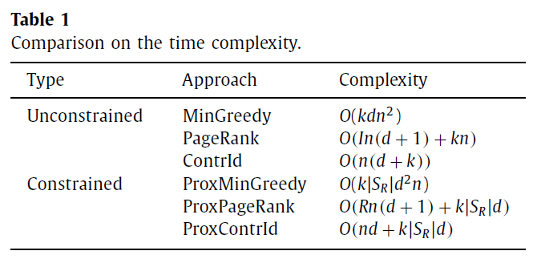

#### 6、实验

> 数据集：2个合成网络、2个真实网络
> 
> * 合成网络：
> 
> > scale-free network:采用 Barabási-Albert model *(A.L. Barabási , R. Albert , Emergence of scaling in random networks, Science 286 (5439) (1999) 509–512 .)* 生成500个顶点的网络。
> > 
> > Small-world network：小世界网络是指大多数节点与其他节点没有联系，但某一节点的邻居有可能相互联系的网络。此外，网络中的大多数节点可以通过几步或几跳到达任何其他节点。通过采用Watts-Strogatz模型[(详情)](https://wiki.swarma.org/index.php/WS%E5%B0%8F%E4%B8%96%E7%95%8C%E6%A8%A1%E5%9E%8B_Watts%E2%80%93Strogatz_model) *(D.J. Watts , S.H. Strogatz , Collective dynamics of ’small-world’ networks, Nature 393 (6684) (1998) 4 40–4 42 .)*，并将规则格子的平均度数设定为4，重布线概率$β=0.2$，生成了一个有500个节点的小世界网络。
> > 
> > 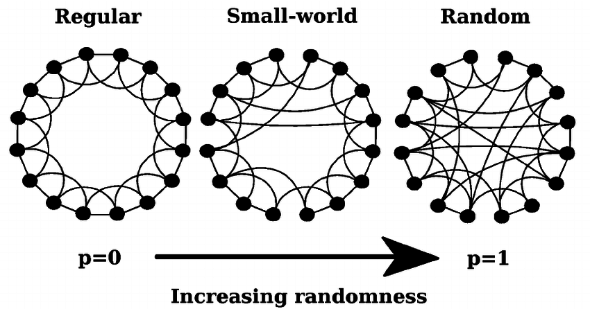
> 
> * 真实网络
> 
> > NetScience、US-power
> 
> 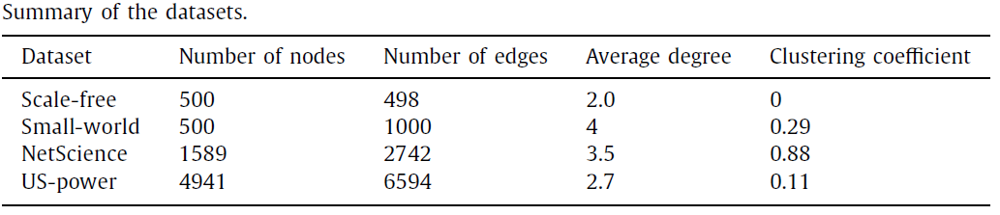
> 
> * 参数
> 
> > 权重 $W(u,v)=1/|N_v^{in}|$; $\theta_u,\theta_u^R$ 在$(0,1]$间均匀随机(uniformly at random);$|S_R|=3$,$|S_T|\in[1,10]$。
> 
> * 结果
> 
> 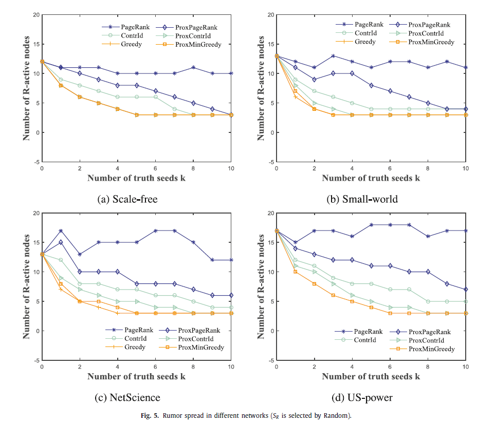
> 
> 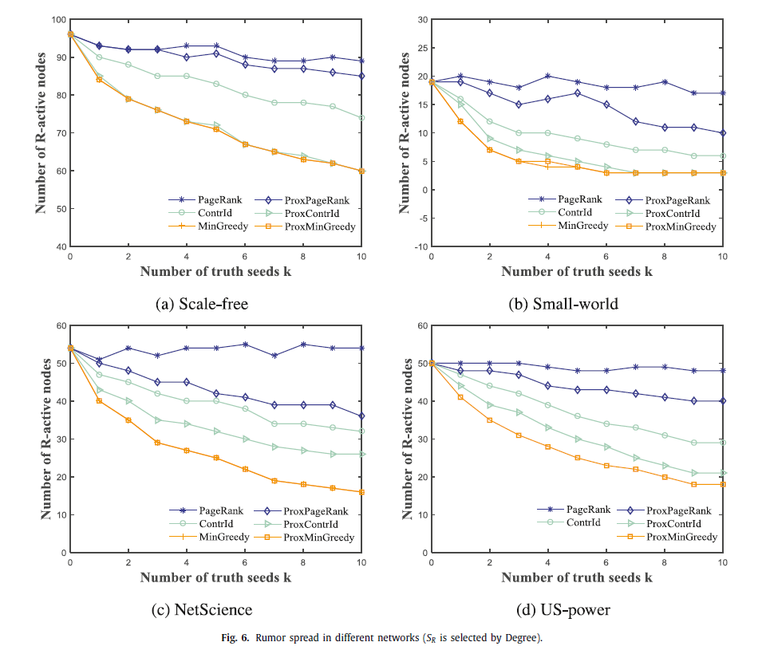
> 
> 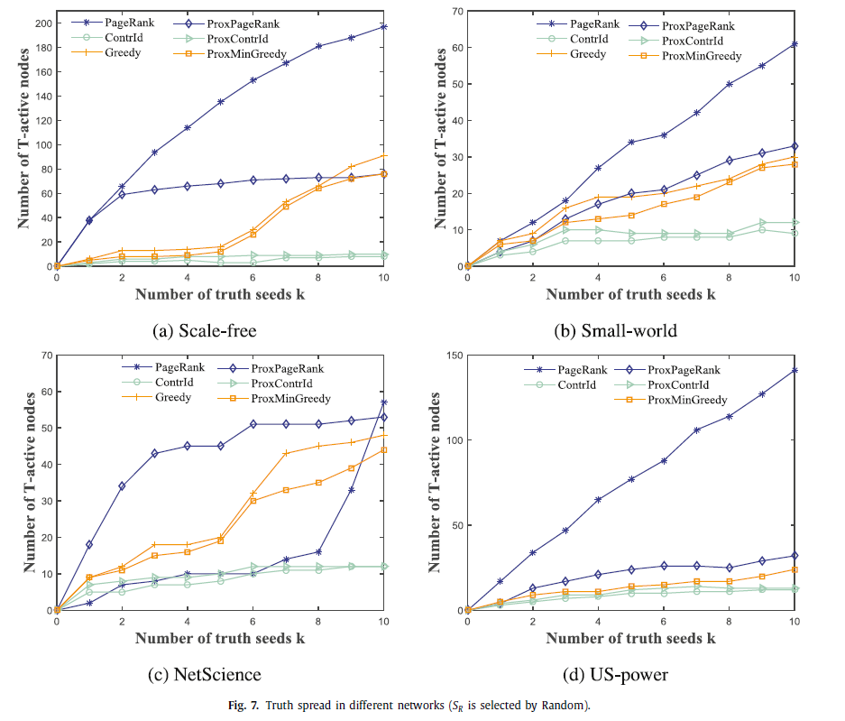
> 
> 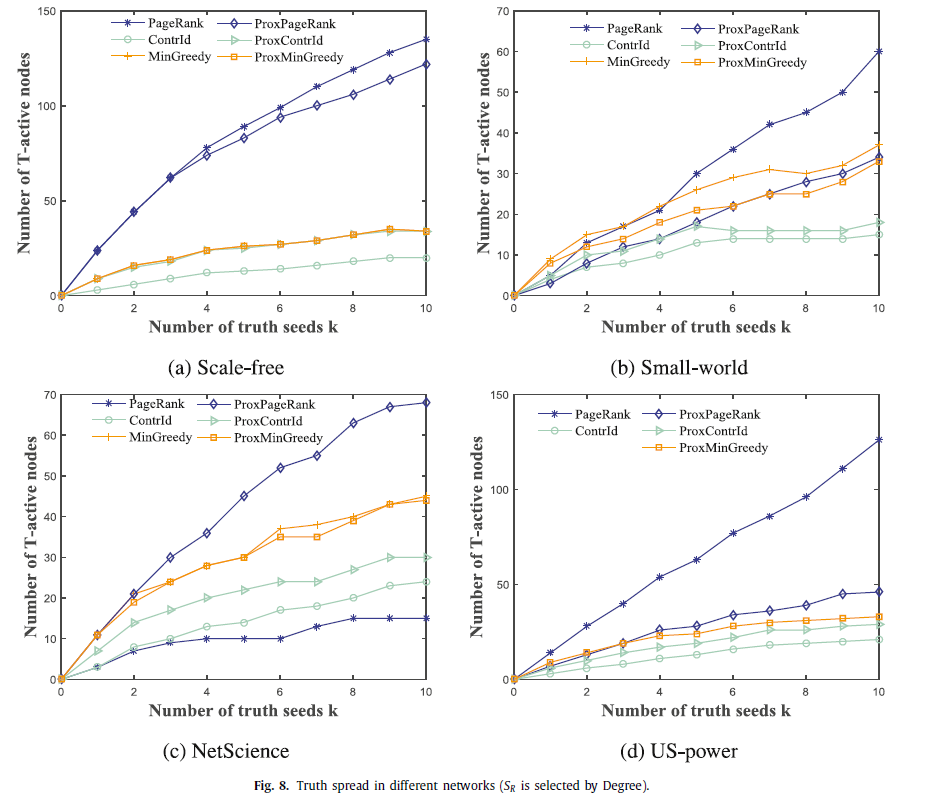
> 
> 综合以上结果图，就效果而言，有$\text{Greedy}\ge \text{ContrId} \ge \text{PageRank}$，PageRank更适合用于影响最大化的问题。
> 
> * 运行时间
> 
> 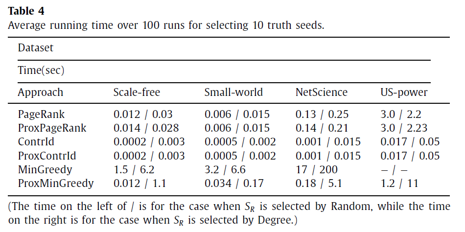
> 
> * 放缩性
> 
> 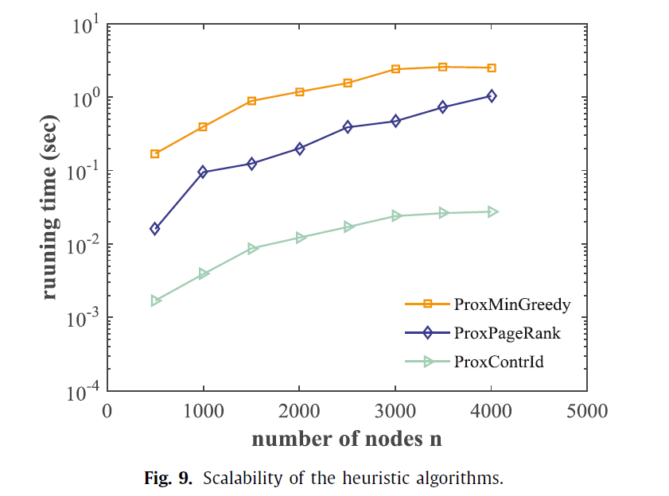

#### 7、未来的研究思路

> 1. 由于人类活动的异质性，影响从一个人传播到他的朋友可能有一定的时间延迟，而且个人之间的影响也可能随着时间的推移而衰减。
> 
> 2. 另一个有趣的话题或趋势是分析有符号的社会网络(signed social network)中的扩散动态，即弧线(arc)与正(positive)或负(negtive)符号相关的网络。社会个体有可能与他们的朋友（与正弧连接）做出相同的决定，而与他们的敌人（与负弧连接）做出相反的决定。
